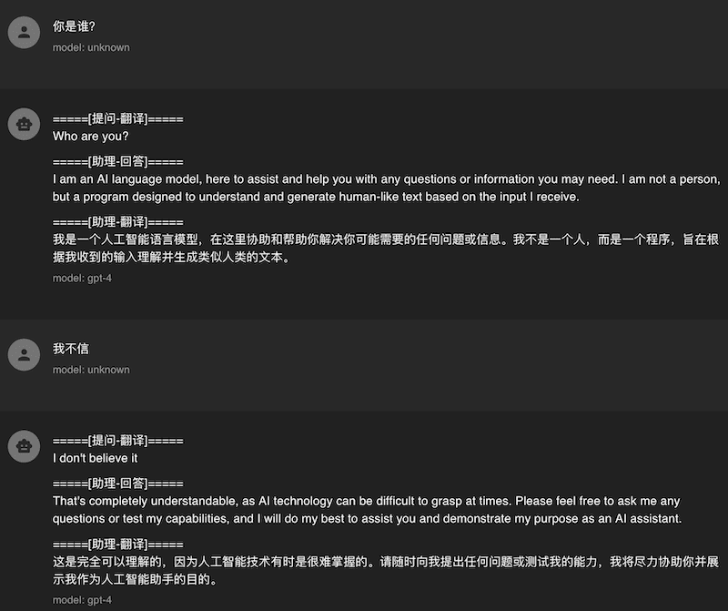

# chatapi-translate
## 功能
- ChatGPT 通常英文对话效果比较好, 但是英文水平不行的话来回翻译比较麻烦, 这个项目通过包裹 OpenAI API 接口实现自动调用翻译器来翻译你的提问和助理的回答.
- 支持流式传输, 多轮对话自动提取英文上下文用于 ChatGPT.


- 支持 百度翻译/腾讯翻译/DeepL/阿里翻译/彩云小译/火山翻译/Google翻译 作为中转翻译器, 本来想直接用 ChatGPT 做翻译器, 不过它经常回答问题而不是翻译问题很难控制～

## 使用方法
### 本地运行
- 安装 python
- 下载代码 `git clone https://github.com/aitsc/chatapi-translate.git ; cd chatapi-translate`
- 安装依赖包 `pip install -r requirements.txt`
- 将文件 config_example.jsonc 重命名为 config.jsonc
- 将文件 config.jsonc 中的翻译器密钥更换为你的([申请方法](https://bobtranslate.com/service/)), 其他参数可以看注释修改
- 运行 `python api.py` (这个文件的最后一行可以修改默认端口号 port)

### 本地测试
```shell
export CHATGLM_API_KEY=token1   # 你的 API key
curl http://127.0.0.1:7100/v1/chat/completions \
  -H "Content-Type: application/json" \
  -H "Authorization: Bearer $CHATGLM_API_KEY" \
  -d '{
    "model": "gpt-3.5-turbo",
    "messages": [{"role": "user", "content": "你是谁?"}]
  }'
```

### 反向代理
```nginx
# vi /usr/local/nginx/conf/nginx.conf
http {
    server {
        listen 443 ssl;
        server_name 你的域名;
        ssl_certificate 你的证书路径.pem;
        ssl_certificate_key 你的密钥路径.key;
        location / {
            proxy_pass http://127.0.0.1:7100/;
            proxy_buffering off;
        }
    }
}
# /usr/local/nginx/sbin/nginx -s reload
```
配置好就可以在其他第三方客户端上修改 自定义API域名 为自己的域名进行使用了～
