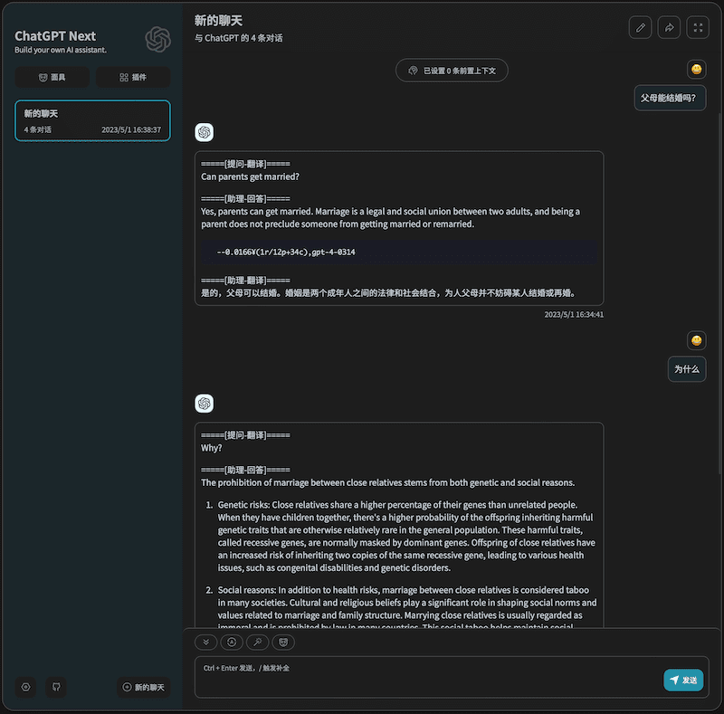

# chatapi-translate
## 功能
- ChatGPT 通常英文对话效果比较好, 但是英文水平不行的话来回翻译比较麻烦, 这个项目通过包裹 OpenAI API 接口实现自动调用翻译器来翻译你的提问和助理的回答.
- 支持流式传输, 多轮对话自动提取英文上下文用于 ChatGPT.


- 支持 百度翻译 / 腾讯翻译 / DeepL / 阿里翻译 / 彩云小译 / 火山翻译 / Google翻译 的API作为中转翻译器 (申请后都有免费额度)
- 支持直接使用 ChatGPT 翻译, 不过它经常回答问题而不是翻译问题[很难控制](images/chatgpt-trans.png), 大家要能找到好的prompt可以分享一下 (见配置示例)
  - 如果肯用 gpt-4 做翻译器, 翻译效果应该还是挺好的
- 不想使用翻译的时候可以输入 "--不翻译\n" (见配置文件)

## 搭建方法
### 1. 本地运行
- 安装 python
- 下载代码 `git clone https://github.com/aitsc/chatapi-translate.git ; cd chatapi-translate`
- 安装依赖包 `pip install -r requirements.txt`
- 将文件 config_example.jsonc 重命名为 config.jsonc
- 将文件 config.jsonc 中的翻译器密钥更换为你的([申请方法](https://bobtranslate.com/service/)), 其他参数可以看注释修改
- 运行 `python api.py --port 7100`

### 2. 本地测试
```shell
export CHATGLM_API_KEY=token1   # 你的 API key
curl http://127.0.0.1:7100/v1/chat/completions \
  -H "Content-Type: application/json" \
  -H "Authorization: Bearer $CHATGLM_API_KEY" \
  -d '{
    "model": "gpt-3.5-turbo",
    "messages": [{"role": "user", "content": "你是谁?"}]
  }'
```

### 3. 反向代理
```nginx
# vi /usr/local/nginx/conf/nginx.conf
http {
    server {
        listen 443 ssl;
        server_name 你的域名;
        ssl_certificate 你的证书路径.pem;
        ssl_certificate_key 你的密钥路径.key;
        location / {
            proxy_pass http://127.0.0.1:7100/;
            proxy_buffering off;
        }
    }
}
# /usr/local/nginx/sbin/nginx -s reload
```
配置好就可以在其他第三方客户端上修改 自定义API域名 为自己的域名进行使用了～

## 免搭建体验
借助 [ChatGPT Next Web](https://github.com/Yidadaa/ChatGPT-Next-Web) 项目自建了一个自动翻译对话的演示站点

有需要的话可直接进行体验: https://chatapi-translate.vercel.app



可以自动统计每次对话的token数量和官方API价格, 因为用了英文也更节省token～

(使用免费的翻译接口, 可能并发数量和额度有限制, 不建议大量使用)
